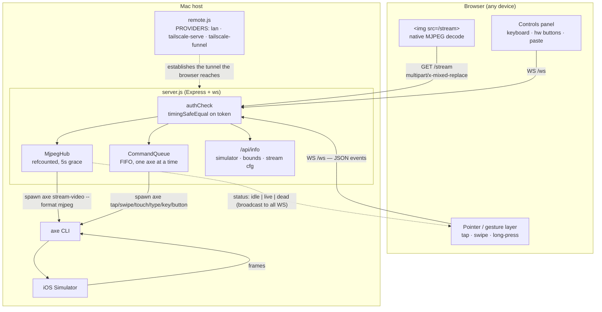
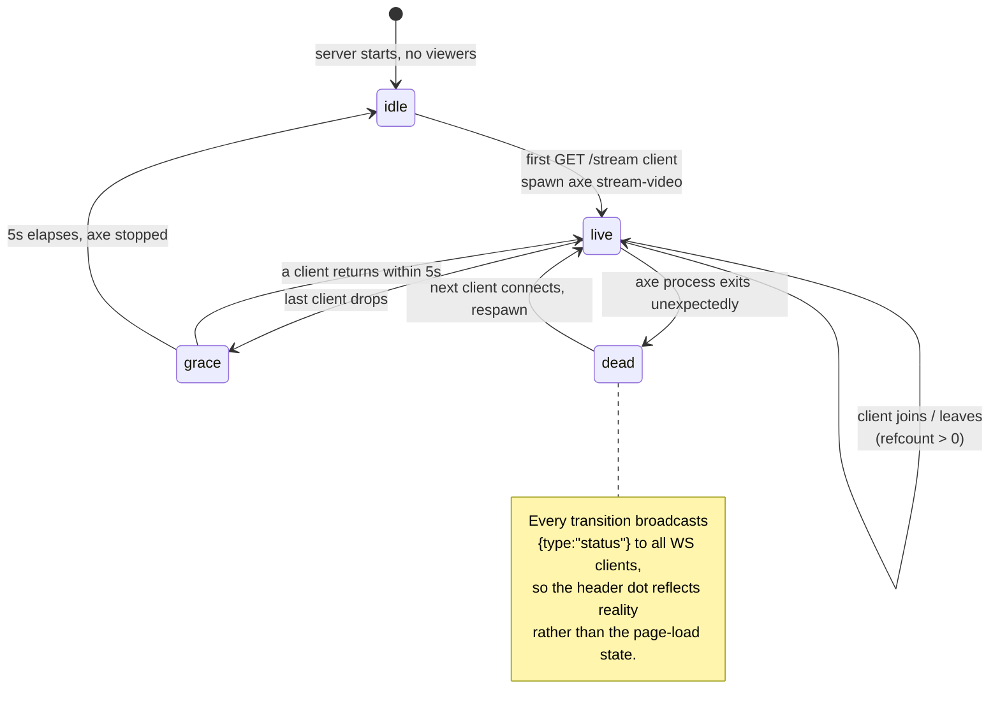

# Overview — the system as built

> Inferred by /adopt from the codebase — verify.
>
> **Present tense only**: this describes what exists today. Plans live in
> `docs/ROADMAP.md`, history in `docs/JOURNAL.md`, the engineering contract in
> `docs/architecture.md`.

`sim-stream` puts a live, interactive iOS Simulator in a web browser. A Node
server on the Mac that hosts the simulator spawns the [AXe
CLI](https://github.com/cameroncooke/AXe) to capture frames and to inject
input, and serves both over plain HTTP/WebSocket behind a token in the URL.
There are no cloud services, no accounts, and no build step — `npm i && node
server.js`.

## Architecture

## State model

There is no database and nothing persists between runs. The only durable
artifacts are screenshots written to `~/Desktop/`. What the system holds is
process state:

Per-run configuration, resolved once at startup and never mutated: `PORT`,
`HOST`, `FPS`, `QUALITY`, `SCALE`, the simulator UDID, its logical `bounds`,
and `TOKEN`.

## User stories, as currently implemented

**Watch a simulator from another device.** Run `./scripts/start.sh --remote lan`
(or `--remote tailscale-serve` for the tailnet, `--remote tailscale-funnel` for
a publicly reachable URL). The launcher checks that AXe is installed, installs
node deps if missing, boots the chosen simulator if it isn't running, and
prints a URL with the token embedded. Opening it shows the live screen.

**Pick which simulator.** `--list` prints every available device with its boot
state. Without `--udid`, the server auto-picks — preferring one that's already
booted. `/api/info` reports the chosen device and its logical bounds, which the
client uses to size the view before the first frame arrives (no layout flash).

**Drive the UI by touch.** Click or tap to tap; drag to swipe; hold ≥500 ms
without moving for a long-press. The browser sends normalized `(0..1, 0..1)`
coordinates; the server maps them to logical points via a per-device-type
bounds table. Every command is acked back over the WebSocket.

**Type into the app.** Focus the text field in the controls panel and type —
`Enter`, `Backspace`, `Tab`, `Esc`, and the arrow keys are recognized as
keycodes. For longer strings, the "Paste Text" textarea sends the whole string
in one command rather than keystroke-by-keystroke.

**Press hardware buttons and send quick gestures.** Home, Lock, and Siri are
buttons in the panel. The ▲/▼/←/→ controls send preset swipes from the center
of the screen.

**Capture what you're looking at.** The screenshot control saves to
`~/Desktop/sim-stream-<timestamp>.png` and confirms with a toast.

**Use it on a phone.** At ≤720 px wide the layout goes fullscreen and the
controls collapse into a bottom sheet behind a corner ⋯ button. Backdrop tap or
a downward drag on the handle dismisses it. Hardware, gesture, and send-text
actions close the sheet automatically; keyboard quick-keys deliberately don't,
so they can be chained.

## What it does not do

Known and accepted, not defects:

- **~7–10 fps.** AXe's capture is a screenshot loop, so the `--fps` flag is an
  upper bound it won't reach. Fine for verifying layout and placement; not
  enough for judging animation or scroll feel.
- **US keyboard only.** AXe's `type` uses HID keycodes — no accented or
  non-ASCII characters.
- **Single touch.** No pinch, no rotate, no multi-finger gestures.
- **One simulator per server.** The UDID is fixed at startup.
- **No stream heartbeat beyond start/stop.** If the AXe process *hangs* rather
  than exits, the status dot can stay green until something eventually throws.
- **A permanent token in the URL** is the only access control. See
  `docs/ROADMAP.md` § Phase 5.
