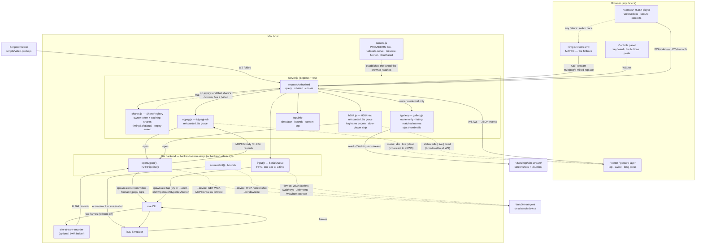
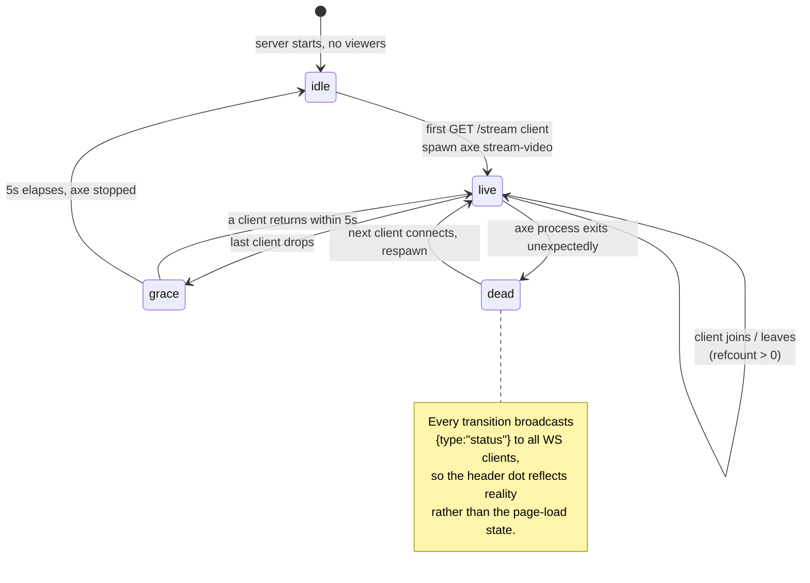
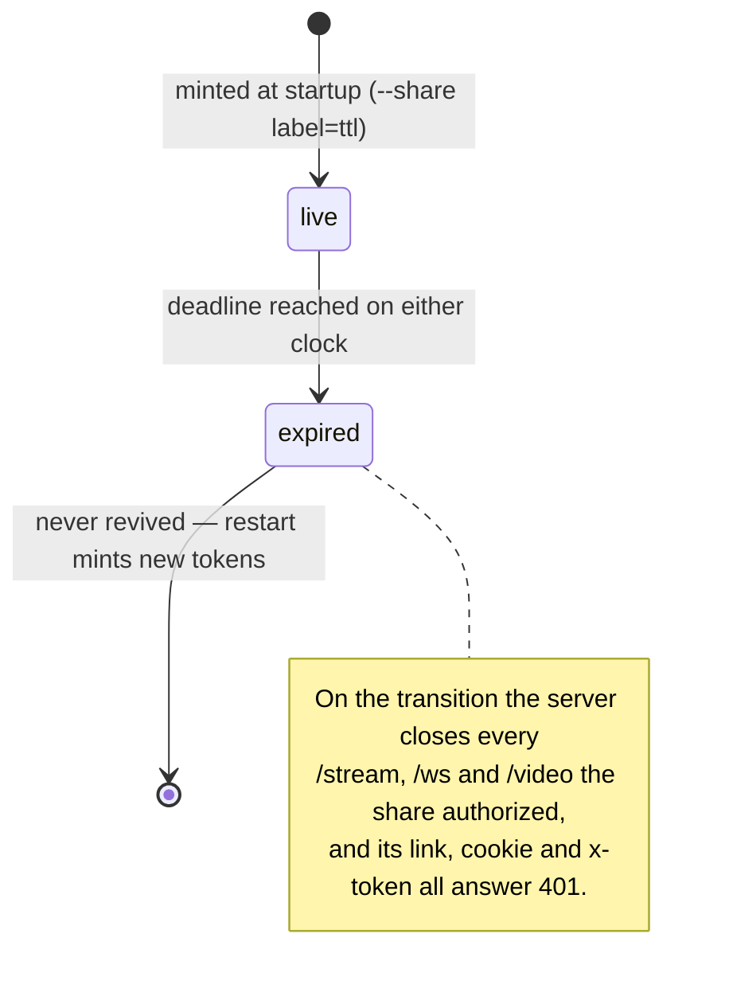

# Overview — the system as built

> Inferred by /adopt from the codebase — verify.
>
> **Present tense only**: this describes what exists today. Plans live in
> `docs/ROADMAP.md`, history in `docs/JOURNAL.md`, the engineering contract in
> `docs/architecture.md`.

`sim-stream` puts a live, interactive iOS Simulator — or, with `--device`, a
real QA-bench iPhone or iPad — in a web browser. A Node server on the Mac
drives the target through a **backend** — `backends/simulator.js`, which
spawns the [AXe CLI](https://github.com/cameroncooke/AXe) to capture frames
and to inject input, or `backends/device.js`, which talks to the
WebDriverAgent running on a USB-tethered device — and serves both over plain HTTP/WebSocket behind a shareable token link (exchanged
for an httpOnly cookie on first load). Everything above the backend (auth,
shares, tunnels, the player, the gallery) is target-agnostic. Links minted for other people expire on
their own.
There is no account, no hosted backend, and no required build step — `npm i &&
node server.js`. An optional Swift helper adds a 30 fps H.264 stream beside the
MJPEG one, which the page plays wherever the browser can decode it (https or
`localhost`) and falls back from on its own. Reaching it from outside the machine is opt-in: `--remote` selects
a provider (LAN, Tailscale, or a Cloudflare quick tunnel), and that is the only point at which anything
leaves the host.

## Architecture

```mermaid
flowchart TB
    subgraph browser["Browser (any device)"]
        player["&lt;canvas&gt; H.264 player<br/>WebCodecs · secure contexts"]
        img["&lt;img src=/stream&gt;<br/>MJPEG — the fallback"]
        ptr["Pointer / gesture layer<br/>tap · swipe · long-press"]
        ctl["Controls panel<br/>keyboard · hw buttons · paste"]
    end

    subgraph mac["Mac host"]
        subgraph srv["server.js (Express + ws)"]
            auth["requestAuthorized<br/>query · x-token · cookie"]
            reg["shares.js — ShareRegistry<br/>owner token + expiring shares<br/>timingSafeEqual · expiry sweep"]
            hub["mjpeg.js — MjpegHub<br/>refcounted, 5s grace"]
            vhub["h264.js — H264Hub<br/>refcounted, 5s grace<br/>keyframe on join · slow-viewer skip"]
            info["/api/info<br/>simulator · bounds · stream cfg"]
            gal["/gallery — gallery.js<br/>owner only · listing-matched names<br/>sips thumbnails"]
        end
        subgraph be["the backend — backends/simulator.js (or backends/device.js)"]
            src["openMjpeg() · h264Pipeline()"]
            queue["input() → SerialQueue<br/>FIFO, one axe at a time"]
            shot["screenshot() · bounds"]
        end
        remote["remote.js<br/>PROVIDERS: lan · tailscale-serve · tailscale-funnel · cloudflared"]
        axe["axe CLI"]
        enc["sim-stream-encoder<br/>(optional Swift helper)"]
        sim["iOS Simulator"]
    end
    script["Scripted viewer<br/>scripts/video-probe.js"]

    img -- "GET /stream<br/>multipart/x-mixed-replace" --> auth
    ptr -- "WS /ws — JSON events" --> auth
    ctl -- "WS /ws" --> auth
    auth -- "match token" --> reg
    auth --> hub
    auth --> vhub
    player -- "WS /video — H.264 records" --> auth
    player -. "any failure: switch once" .-> img
    script -- "WS /video" --> auth
    auth --> queue
    auth --> info
    auth -- "owner credential only" --> gal
    gal -- "read ~/Desktop/sim-stream/" --> desk["~/Desktop/sim-stream/<br/>screenshots + .thumbs/"]
    reg -. "on expiry: end that share's /stream, /ws + /video" .-> auth
    hub -- "open" --> src
    vhub -- "open" --> src
    src -- "spawn axe stream-video --format mjpeg / bgra" --> axe
    axe -- "raw frames (fd hand-off)" --> enc
    enc -- "H.264 records" --> src
    src -- "MJPEG body / H.264 records" --> hub
    queue -- "spawn axe tap (x/y or --label/--id)/swipe/touch/type/key/button" --> axe
    shot -- "xcrun simctl io screenshot" --> sim
    axe --> sim
    sim -- "frames" --> axe
    src -. "--device: GET WDA MJPEG via ios forward" .-> wda["WebDriverAgent<br/>on a bench device"]
    shot -. "--device: WDA /screenshot · /window/size" .-> wda
    queue -. "--device: WDA /actions · /wda/keys · /elements · /wda/homescreen" .-> wda
    hub -. "status: idle | live | dead (broadcast to all WS)" .-> ptr
    vhub -. "status: idle | live | dead (broadcast to all WS)" .-> ptr
    remote -. "establishes the tunnel the browser reaches" .-> srv
```

## State model

There is no database and nothing persists between runs. The only durable
artifacts are screenshots written to `~/Desktop/sim-stream/` (plus their
cached thumbnails in `.thumbs/` there). What the system holds is
process state — the capture process below, and the token registry after it.
The H.264 hub runs the same state machine over its own pipeline (AXe plus the
encoder helper), independently of the MJPEG one:

```mermaid
stateDiagram-v2
    [*] --> idle: server starts, no viewers
    idle --> live: first GET /stream client<br/>spawn axe stream-video
    live --> live: client joins / leaves<br/>(refcount > 0)
    live --> grace: last client drops
    grace --> live: a client returns within 5s
    grace --> idle: 5s elapses, axe stopped
    live --> dead: axe process exits unexpectedly
    dead --> live: next client connects, respawn
    note right of dead
        Every transition broadcasts
        {type:"status"} to all WS clients,
        so the header dot reflects reality
        rather than the page-load state.
    end note
```

Each token in the registry has its own small lifecycle. The owner token stays
`live` for the whole run; a share does not:

```mermaid
stateDiagram-v2
    [*] --> live: minted at startup (--share label=ttl)
    live --> expired: deadline reached on either clock
    expired --> [*]: never revived — restart mints new tokens
    note right of expired
        On the transition the server closes every
        /stream, /ws and /video the share authorized,
        and its link, cookie and x-token all answer 401.
    end note
```

Per-run configuration, resolved once at startup and never mutated: `PORT`,
`HOST`, `FPS`, `QUALITY`, `SCALE`, the backend (which simulator or device, its logical
`bounds`, whether the H.264 path exists — helper built, screen size measured —
and its picture size), and the set of tokens (the registry gains no entries after startup; shares
only expire out of it).

## User stories, as currently implemented

**Watch a simulator from another device.** Run `./scripts/start.sh --remote lan`
(or `--remote tailscale-serve` for the tailnet; `--remote tailscale-funnel`, or
`--remote cloudflared` with no account at all, for a publicly reachable https
URL — the one route that gives a phone the 30 fps H.264 stream). The launcher checks that AXe is installed, installs
node deps if missing, boots the chosen simulator if it isn't running, and
prints a URL with the token embedded. Opening it sets an httpOnly cookie and
redirects to the token-free URL, then shows the live screen; the stream and
the input WebSocket authenticate from that cookie.

**Hand someone a link that stops working.** Add `--share demo=2h` (repeatable;
units `s`/`m`/`h`/`d`). Startup prints one extra link per share with its exact
deadline, on the remote URL when there is one. At the deadline the link, the
cookie it left behind, and any tab still open on it all stop together — the
stream is cut and the page says the link has expired. The operator's own token
is unaffected and lasts until the server stops; restarting the server revokes
every link at once.

**Pick which simulator.** `--list` prints every available device with its boot
state. Without `--udid`, the server auto-picks — preferring one that's already
booted. `/api/info` reports the chosen device and its logical bounds, which the
client uses to size the view before the first frame arrives (no layout flash).

**Watch a real bench device.** `qa-device up primary`, then
`./scripts/start.sh --device primary` (a role resolves to the device's UDID and
its WDA port through `qa-device`; `--device <udid> --wda <url>` works without
it). The server checks WDA, names the device from go-ios (`MGL-QA-16E`), sets
WDA's stream to the `--fps`/`--scale`/`--quality` flags (30 fps by default
here), forwards the device's MJPEG port with `ios forward`, and serves the
same page, links and shares — the picture runs at ~28 fps. Input goes
through WDA, one command at a time: touches as W3C pointer actions (~1 s per
tap on the 16e), text and Return/Backspace/Tab/Space through `/wda/keys`
(Unicode works), Home via `/wda/homescreen`, Lock via `/wda/lock`, tap by label
as a WDA element lookup. Before each command the server checks whether the
device auto-locked and, if so, unlocks it with a home-screen press; a tap or
swipe aimed at the lock screen is spent on that unlock. Siri, Apple Pay,
Escape and the arrow keys are refused with an error toast. Screenshots are
WDA's `/screenshot`. A WDA that does not answer stops startup with `Start it
with: qa-device up <role>`; the forward is removed when the server exits.

**Drive the UI by touch.** Click or tap to tap; drag to swipe; hold ≥500 ms
without moving for a long-press. The browser sends normalized `(0..1, 0..1)`
coordinates; the backend maps them to logical points via a per-device-type
bounds table. Every command is acked back over the WebSocket.

**Type into the app.** Focus the text field in the controls panel and type —
`Enter`, `Backspace`, `Tab`, `Esc`, and the arrow keys are recognized as
keycodes. For longer strings, the "Paste Text" textarea sends the whole string
in one command rather than keystroke-by-keystroke.

**Tap an element by name.** The "Tap by Label" field takes an accessibility
label (`Sign In`) or `#` plus an accessibility identifier (`#login.submit`);
Enter or **Tap** sends it. AXe (or, on a device, WDA) finds the element and
taps it — no pixel hunting when checking agent-built UI. A label that matches
nothing, or more than one element, taps nothing and says so in the error
toast. On a device only on-screen matches count, a control whose own icon and
text share its label counts once, and `#id` matches WDA's `name` (the
identifier, or the label when there is none).

**See why an input was refused.** Every error ack the server sends shows as a
red toast — a failed tap by label, a key or button the target cannot press, a
WDA or AXe failure.

**Press hardware buttons and send quick gestures.** Home, Lock, and Siri are
buttons in the panel. The ▲/▼/←/→ controls send preset swipes from the center
of the screen.

**See the screen at 30 fps.** When the encoder helper is built and the page is
on https or `localhost`, it plays `/video` — decoded by the browser's WebCodecs
into a canvas — and the header reads **H.264**. Anywhere else (plain-http
`--remote lan`, no helper, a browser without WebCodecs) it shows the MJPEG
stream and the header reads **MJPEG**; hover it for the reason. If the H.264
stream fails mid-session — the decoder errors, the capture dies, no frame for a
few seconds — the page switches to MJPEG once and stays there until reloaded.
Taps, swipes and long-presses land the same way on either. A hidden tab lets go
of `/video` and rejoins when shown.

**Pull a 30 fps H.264 stream from a script.** When the encoder helper is built
(`./scripts/start.sh` builds it if `swift` is available; `npm run build:helper`
does it by hand), the server also offers `/video`: a WebSocket that sends a
`config` message and then one H.264 frame per binary message, starting on a
keyframe. It takes the same token, cookie or header as everything else, and a
share link's expiry closes it like any other connection. `/api/info` says
whether it is available and how large the picture is. Without the helper the
server runs exactly as before and says "MJPEG only" at startup.
`scripts/video-probe.js` is the ready-made client: it reports the frame rate
and can save the stream for `ffprobe`.

**Capture what you're looking at.** The screenshot control saves to
`~/Desktop/sim-stream/sim-stream-<date>-<time>.png` and confirms with a toast.

**Find it again.** The owner's controls panel links to `/gallery`: every
screenshot in that folder, newest first, as `sips` thumbnails that open the
full image. It is read-only, and it answers only to the owner credential — a
share link's viewer sees no link and gets `403` (with `--auth false`, like
everything else, it is open).

**Use it on a phone.** At ≤720 px wide the layout goes fullscreen and the
controls collapse into a bottom sheet behind a corner ⋯ button. Backdrop tap or
a downward drag on the handle dismisses it. Hardware, gesture, send-text and
tap-by-label actions close the sheet automatically; keyboard quick-keys deliberately don't,
so they can be chained.

## What it does not do

Known and accepted, not defects:

- **~7–10 fps on the MJPEG fallback.** That is what AXe's MJPEG mode
  delivers, so there the `--fps` flag is an upper bound it won't reach — which
  includes every plain-http `--remote lan` link, since browsers decode H.264
  only on https or `localhost`.
- **US keyboard only on a simulator.** AXe's `type` uses HID keycodes — no
  accented or non-ASCII characters (a device types Unicode through WDA).
- **Single touch.** No pinch, no rotate, no multi-finger gestures.
- **One target per server.** A simulator or a device, fixed at startup;
  `--device` and `--udid` refuse each other.
- **A device is MJPEG-only for now, and slower to drive.** No H.264 from a
  device yet. WDA answers a touch once the app is idle (~1 s a tap); Home
  pressed on the home screen answers only after ~10 s, holding the queue; the
  Lock button times out on the iOS 26 bench (WDA cannot lock it). A device that
  auto-locks shows its lock screen until the next input unlocks it.
- **No stream heartbeat beyond start/stop.** If the AXe process *hangs* rather
  than exits, the status dot can stay green until something eventually throws.
  The H.264 pipeline's status stays `live` too, but the page notices the
  missing frames and falls back to MJPEG.
- **Shares can't be extended, revoked one at a time, or minted while
  running.** They are fixed at startup; the only revocation is restarting the
  server, which kills every link including the operator's own.
- **The operator's own token never expires** within a run, and it is the one
  printed on the `local:` / `--remote` lines. Handing *that* link out instead
  of a `--share` link gives away access that only a restart ends.
